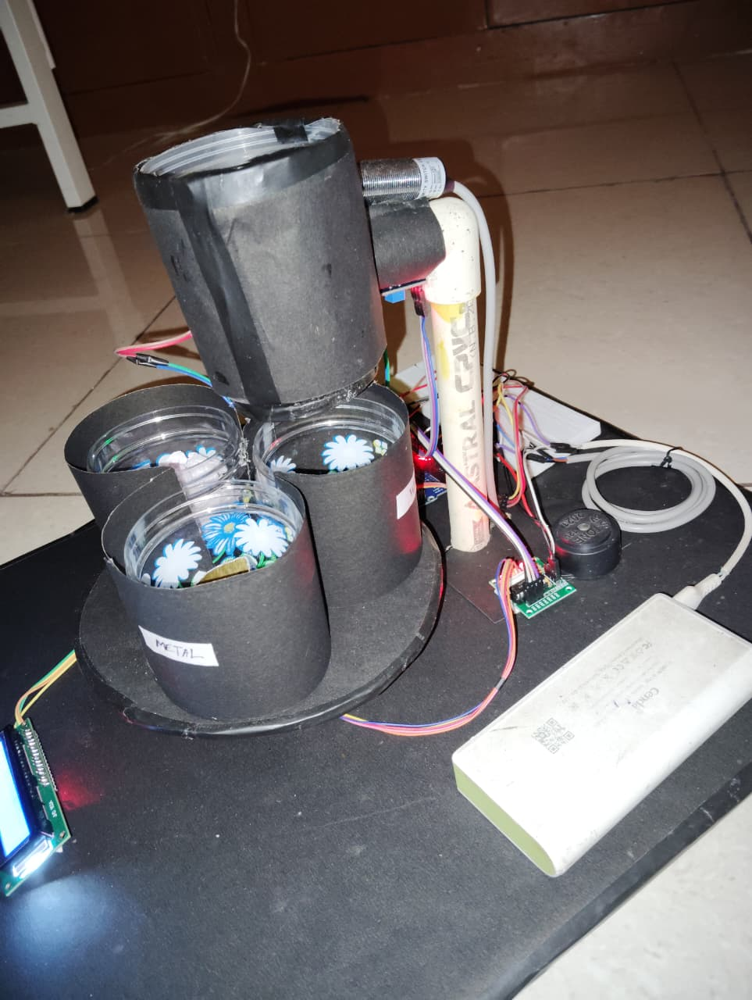
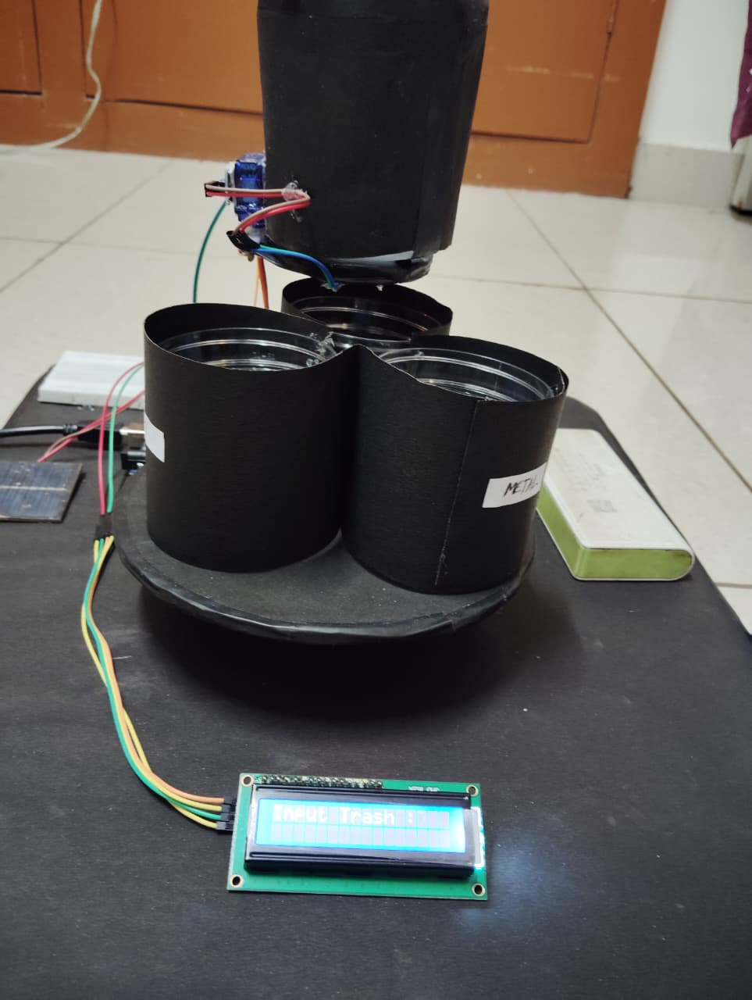

# Automated-Waste-Segregation-System-for-Efficient-Recycling

##  Overview
The Smart Waste Segregation System is an automated solution designed to classify waste into three categories: **Dry**, **Wet**, and **Metal**. Proper waste segregation is essential for effective recycling and environmental protection. This project aims to reduce manual effort and improve the efficiency of waste management systems.

---

## Objectives
- Automate the process of waste segregation
- Reduce human involvement in waste handling
- Improve recycling efficiency
- Promote eco-friendly waste management practices

---

##  Project Description
This system uses sensor-based technology to identify different types of waste. A **moisture sensor** detects wet waste, while a **metal detector sensor** identifies metal objects. The system processes this data using a microcontroller and automatically directs the waste into the appropriate bin using a motor mechanism.

If the waste is neither wet nor metal, it is categorized as dry waste by default.

---

##  System Architecture
1. Waste is inserted into the input section
2. Moisture sensor checks for wet waste
3. Metal detector checks for metallic waste
4. Microcontroller processes sensor data
5. Servo motor rotates to direct waste into:
   - Dry Waste Bin
   - Wet Waste Bin
   - Metal Waste Bin

---

##  Components Used
- Microcontroller (Arduino Uno)
- Moisture Sensor
- Metal Detector Sensor
- Servo Motor / DC Motor
- Power Supply
- Connecting Wires
- Waste Bins (3 types)
- Conveyor Belt (Optional)

---

##  Working Principle
- **Step 1:** Waste is placed into the system  
- **Step 2:** Moisture sensor checks if the waste is wet  
- **Step 3:** Metal detector checks for metal presence  
- **Step 4:** Microcontroller analyzes input data  
- **Step 5:** Motor mechanism directs waste into correct bin  

---

##  Features
- Automatic waste classification
- Simple and cost-effective design
- Reduces manual labor
- Environment-friendly solution
- Easy to implement and maintain

---

## Applications
- Smart dustbins
- Homes and residential apartments
- Public places (railway stations, malls, parks)
- Municipal waste management systems

---

##  Future Scope
- Integration with IoT for real-time monitoring
- Mobile app for tracking waste levels
- AI/ML-based waste classification
- Solar-powered system for energy efficiency
- Smart alerts for bin overflow

---

##  Advantages
- Improves recycling process
- Reduces pollution
- Saves time and effort
- Promotes sustainable living

---

##  Limitations
- Limited accuracy for complex waste types
- Requires proper calibration of sensors
- Initial setup cost

---

##  Installation & Setup
1. Connect all components as per circuit diagram  
2. Upload Arduino code to the microcontroller  
3. Power the system  
4. Test using different types of waste  

##  Demo
## 📷 Project Images

## 📽️ Demo Video

[▶️ Watch Video](./Video1.mp4)

##  Contributing
Contributions are welcome! Feel free to fork this repository and submit pull requests.

---

---

##  Acknowledgement
This project is developed as part of academic learning and innovation in smart waste management systems.
